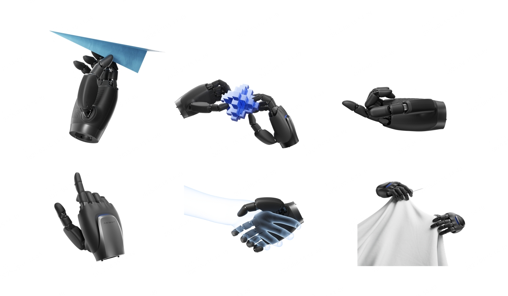
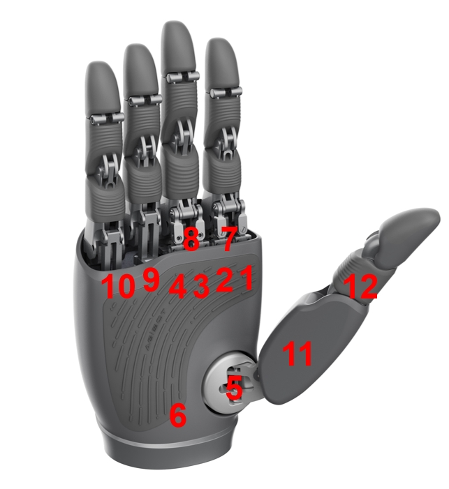

# OmniHand Pro 2025 SDK

## Overview

OmniHand Pro 2025 is a professional dexterous hand featuring precise operation, flexible control, 0.1N-level tactile closed-loop system, and multi-modal sensing capabilities (position, force sensing, proximity detection, etc.). With its lightweight anthropomorphic design, it can be widely applied in scientific research, entertainment performances, exhibition guidance, and industrial scenarios. To facilitate rapid development and application, we provide the OmniHand Pro 2025 SDK development kit with both Python and C++ API interfaces for hand control and data acquisition.



## Getting Started

### System Requirements

#### Hardware Requirements

- ZLG USBCANFD Series

#### Software Requirements

- Operating System: Ubuntu 22.04 (x86_64)
- Compiler: GCC 11.4 or higher
- Build Tool: CMake 3.22 or higher
- Python: 3.10 or higher

### Installation

You can choose between building from source or using pre-built packages.

#### Building from Source

Execute the following commands in the project root directory:

```bash
./build.sh -DCMAKE_BUILD_TYPE=Release \
           -DCMAKE_INSTALL_PREFIX=./build/install \
           -DBUILD_PYTHON_BINDING=ON \
           -DBUILD_CPP_EXAMPLES=OFF \
```

#### Pre-built Packages

##### Python Package Installation

```bash
# Download the corresponding Python wheel package from GitHub
# Example: agibot_hand_py-1.0.0-cp310-cp310-linux_x86_64.whl
pip install agibot_hand_py-1.0.0-cp310-cp310-linux_x86_64.whl
```

##### C++ Library Installation

```bash

```

## Dexterous Hand Motor Index

OmniHand Pro 2025 has 12 degrees of freedom, with indices ranging from 1 to 12. The control motors corresponding to each index are shown in the following figure:



## Running Examples

## Directory Structure

```bash
├── thirdParty              # Third-party dependencies
├── src                     # C++ core source code
│   ├── proto.h
│   ├── export_symbols.h
│   ├── CMakeLists.txt
│   ├── can_bus_device
│   ├── c_agibot_hand.h
│   └── c_agibot_hand.cc
├── scripts                 # Utility scripts
│   └── setup.sh
├── python                  # Python bindings (Python interface generated from C++ source)
├── examples                # C++ example code
├── document                # Documentation
├── CMakeLists.txt         # Main CMake configuration
├── cmake                   # CMake modules
└── build.sh               # Build script
```

## API Documentation

For detailed API usage, please refer to:

- [OmniHand Pro 2025 SDK C++ API Documentation](document/API_CPP.md)
- [OmniHand Pro 2025 SDK Python API Documentation](document/API_PYTHON.md)

## FAQ

### Q1: xxxxxxxxxxxxxxx?

**A:** xxxxxxxxxxxxxx:

```shell

```

## License

Copyright (c) 2025 Agibot Co., Ltd. OmniHand Pro 2025 SDK is licensed under Mulan PSL v2.

---

_Document Version: v1.0.0_  
_Last Updated: 2025-08_
